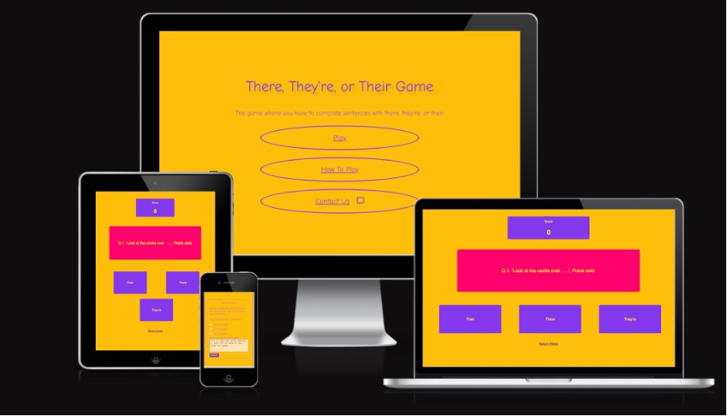
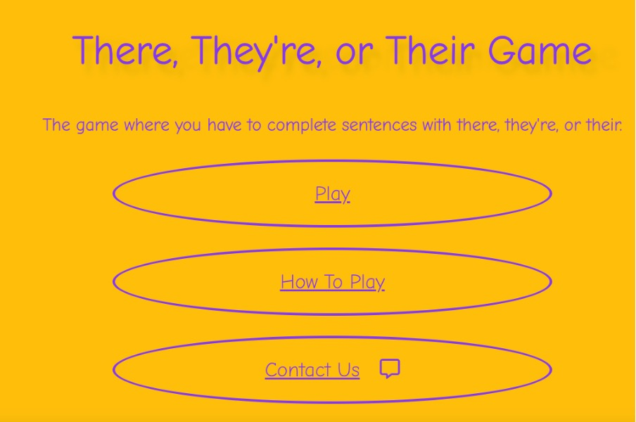
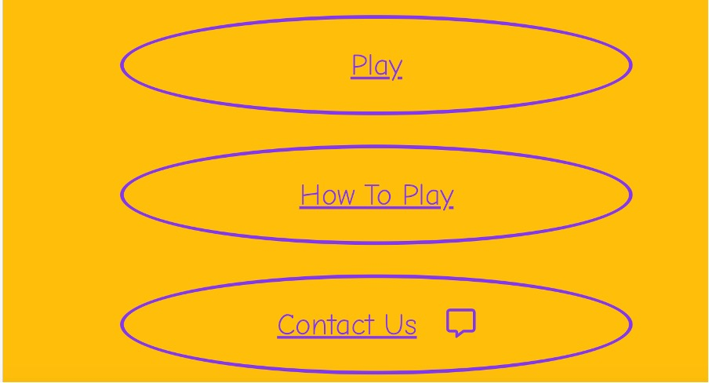
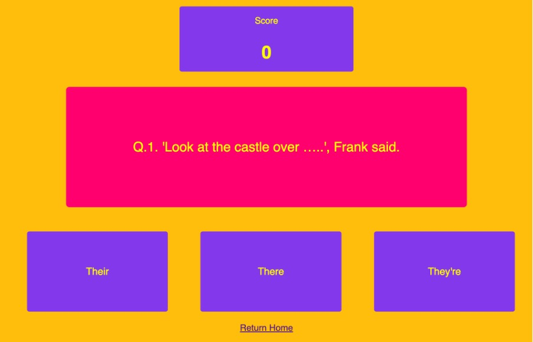
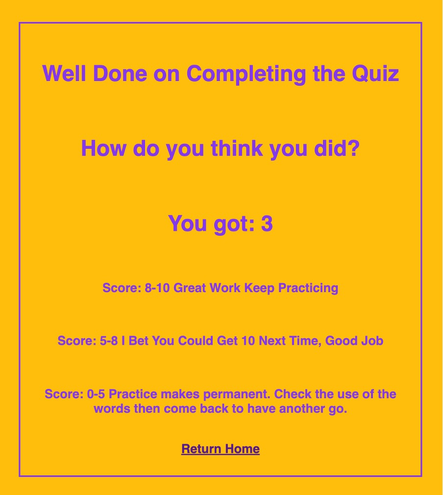
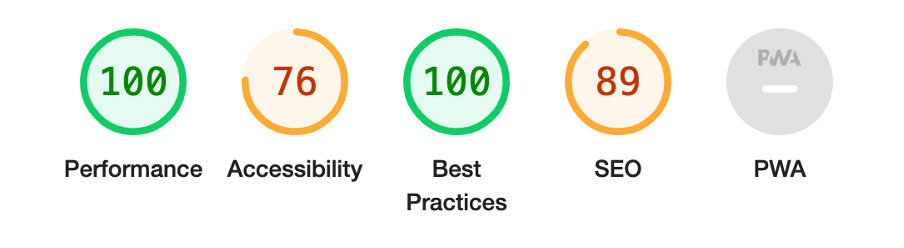
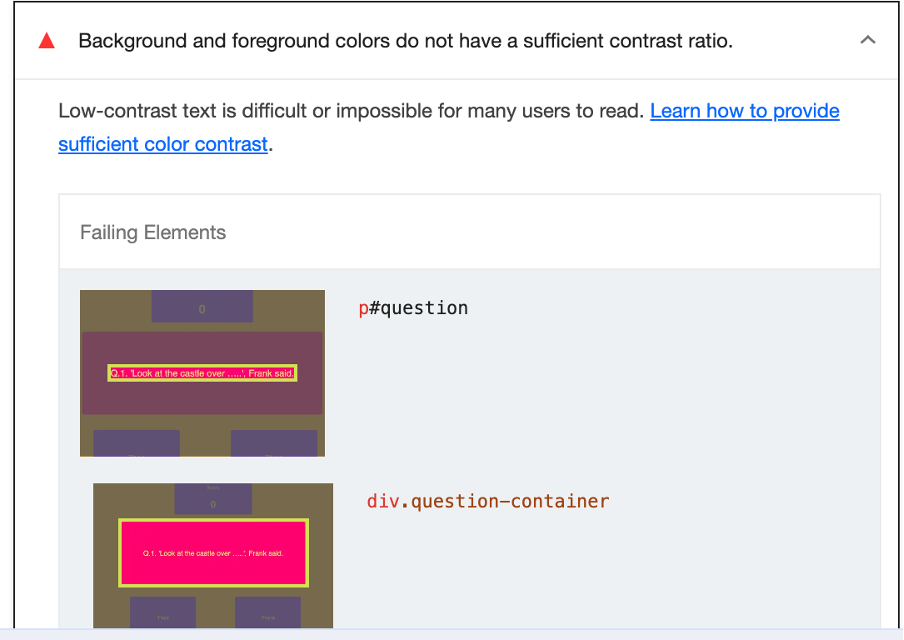
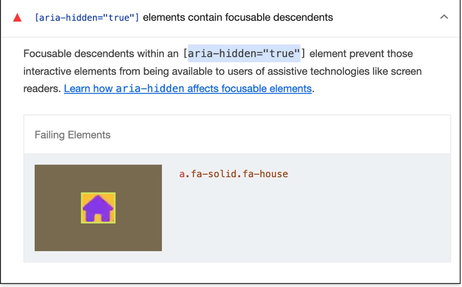

# There, Their, or They're Spelling Game 

This is a website tagetted at children but which can be used by any English language learner, to help practice their skills with the tricky there, their, or they're homophone. The aim of the site is to provide guidance on the spelling skill whilst also allowing the user to test their understanding. There is also a contact form on the website in case users have any comments for improvements which could be made. 

## Features 

### Existing Features 

**Landing Page Image**

- The landing page is bright and colourful, a theme continued throughout the site. This provides an eye-catching hook for the site's main intended users, children. 

- The heading is clearly displayed at the top and introduces the nature of the quiz that is to follow.

- Below the heading further information is given on the purpose of the site. 

**Navigation Buttons**

- The buttons on the landing page allow the user to easily navigate the site. 

- The 'Play' button is at the top as this is the most important button for site use. This button directs the user to the game page. This is followed by the 'How to Play' button, this brings up a modal which gives a reminder of the knoweldge required and instructions on how to play. The final button is a 'Contact Us' button, which brings up a modal with a form which the user can fill in to provide feedback. 

**How To Play Modal**

INCLUDE IMAGE HERE ONCE YOU HAVE EDITED THE PAGE TEXT AND CENTRED HEADING

- The 'How To Play' modal gives a clear list of instructions on how to play the game. 

- There is a 'Refresh Your Understanding' section below the instructions which gives the user a quick recap of the skill to be used. 

- The 'X' in the top right corner of the modal hides the modal again and the user can see the landing page and press play to begin the game.

**Contact Us Modal**

INCLUDE IMAGE HERE ONCE YOU HAVE MOVED THE SUBMIT Button TO CENTRE

- This modal is displayed when the contact us button is pressed on the home page.  

-  The user can indicate whether they are a teacher, student, or parent. This allows the responses to be used effectively. 

- There is a text area in which the user can fill out their comment. 

-There is no space for contact information of the user to be provided. This was a decision made based on safeguarding principles. As the site's main users are likely to be children, it would be inappropriate to request contact information.

**Game Page**

-The game page continues the colour theme from the home page and is laid out simply so that younger users are able to intuitively use the page. 

-The score at the top updates when a question is answered correctly. 

- The question updates each time an answer button is clicked. 

- The three answer buttons are laid out below the question and when clicked, will update the score if necessary. Also, the user will see either a tick or cross displayed after they click a button dependent on their success with the question. 

- At the bottom of the page is a 'Return Home' link which directs the user back to the home page. 

**Game End Modal**

- The 'Game End Modal' is displayed once the final question has been answered. 

- The user sees their final score and gets feedback based on their score. 

- There is a return home button at the bottom of the modal. The text is a darker colour than the rest of the modal to draw attention of the user. 

### Features left to implement 

- The site could be developed to include more quizzes and have more emphasis on teaching. 

- There could also be different sections of the site based upon the user's attainment level. 

- Another useful feature would be a top scores section, or a way for a user's top score to be saved so that they can try to beat their previous attempts. 

## Technologies Used
### Languages

- HTML
- CSS
- JavaScript

### Programmes Used

- Balsamiq
    -For Wireframes
- Git 
    - Used for version control
- Github
    - Used to store the repository for the project.
- Gitpod
    - The IDE used when coding the website. 
- Chrome Developer Tool
    - Used to check responsivity and to troubleshoot issues
- Am I Responsive
    - This site was used to check the responsiveness of the site (https://ui.dev/amiresponsive)
- Goodle Fonts
    - The fonts for the site were taken from Google Fonts

## Testing

The code was validated through the W3C HTML Validator, W3C CSS Validator, and JSHint. These were used to ensure that syntax errors or omissions were rectified prior to submission.
 - (https://validator.w3.org/)
 - (https://jigsaw.w3.org/css-validator/)
 - (https://jshint.com/)

Include images of validator testing. 

HTML Validation
 - The HTML passed the validator with no issues. 

 CSS Validation
 - The CSS validator highlighted a couple of issues in relation to syntax, for example an extra bracket was included and needed removing. Following these changes the CSS passed the validator. 

JS HINT 
- JSHint highlighted a number of missing semi-colons and also a string that was being read as a variable because it did not have inverted commas around it. With these fixes made the JavaScript passed the validator. 

### Lighthouse 

The first lighthouse test came back with the following scores. 

 

Accessibility was improved by a changing of colours on the site to improve readability. The pink question boxes on the game page were made a darker shade and the text on question box and answer buttons was made into a brighter yellow. This provided better contrast and so improved readability. 

 

There was also an issue with the home button, which was a font-awesome home icon. Lighthouse flagged this as an issue in relation to aria-hidden. I tried a few fixes suggested online, for example placing hidden text so that a screen reader could still read the text and the icon could remain as the only visible feature of the button. These still did not improve the issue, so I replaced the icon with text. I will have to do some more work to figure out this problem and why it occured. 

 

### Devices 
- The site was tested on both **Chrome** and **Safari**
- Devices used were iPhone SE, MacBook Air and iPad. 

### Testing User Stories

1. As a user I want to test my use of their, there, or they're in a number of contexts. 
    - There are ten questions, each is a sentence with one word missing. The questions are a mixture of direct speech, and declarative statments. 

2. As a user I want to have support with the spellings of the target words so that I can see the words to embed the spelling, whilst practising the use of the words in context. 
    - There are three button options and the target words are displayed throughout. 

3. As a user I want to know how well I did on the game. 
    - There is a score counter at the top of the game page which updates as the game is played. There is also a final score displayed on the game end modal. 

4. As a user I want to know how I am doing without looking at the score counter after each question. 
    - There is a green tick or red cross displayed after each answer guess, dependant upon the user's success with the question. 

### Fixed Bugs

- There was an error displaying in the console when the page was loaded. To rectify this I added an event listener to allow the DOM content to load prior to the running of the rest of the JavaScript. 

- There was an issue with the contact modal screen on modal devices, the page overflowed to the left of the screen but could not be accessed. Initially I was unsure what was causing the issue, but found it to be the textarea in the end. To fix this I changed the box-sizing in the media query, and this resolved the issue. 

### Functionality

- All buttons were tested and are accessible. 
- All buttons have been tested to ensure they react as expected when hovered over. 
- The game works as intended. 
- All modals work as intended and when teh user exits them, they return to the home page view as expected. 

### Future Features

- The inclusion of a progress bar, could be a good feature in the future. 
- Additional quizzes which test different skills would also enhance the site. 

## Deployment 

- The project was deployed to Github Pages and used the following steps: 

1. Sign in to GitHub and access the [repository](https://github.com/A-Hebbes/spelling-game)
2. Go to settings which can be found towards the top of the repository page. 
3. Once in settings, scroll down to Github Pages.
4. Select the source as main. 
5. Now click save and refresh the page. 

## Credits 

### Code

### Acknowledgements

Prior to validator and lighthouse testing some bugs were evident in preview. I was having issues with the layout of boxes on the screen. The issue seemed to be related to the box borders. I found advice on (https://forum.freecodecamp.org/t/setting-a-right-border-breaks-my-html-and-css-layout/183473) from user **hadrienalllemon** which indicated that I could use border box to bring the child inside the parent. There was also advice to include different box-sizing for different browsers e.g. moz-box-sizing and webkit-box-sizing. Including this in the code solved the issue. 

The background colour of the form did not fit with the site aesthetic so the colour was changed to be more in keeping. This led to readability issues, so I changed the colour of the background and text. 

There were issues with the fieldset element not fitting into the flow of the page on smaller screens. I changed the width of the fieldset to 100% and then the text area I changed to 90%. Using the percentage values allowed for more flexibility on the smaller screen sizes.  

### Validator Testing 

Html and CSS were tested on W3C HTML code validator (https://validator.w3.org/) and W3C CSS code validator(https://jigsaw.w3.org/css-validator/). 

**Html**

An issue was flagged with aria labels in the code validator. The aria attributes were not correct. The issue was that I had just put 'aria' and not 'aria-label'. This was an easy enough fix. Re-running the code through the validator found no issues. 

**CSS**

The validator found no issues with the CSS. 

### Lighthouse

Lighthouse in dev tools was used to check for accesibility. An issue with text contrast with background was flagged in certain sections of the site. To rectify this I changed the background colour of the site to a darker shade of green. This fixed the issue. There was also an issue with the aria labels for the navigation a elements. The aria label didn't match exactly with the text displayed on the screen e.g. Aria label read: **Return to the top of the page** but the text displayed on screen read: **Back to top** Lighthouse said that this can lead to confusion for users who use screen readers. I made the change so that aria labels matched the text displayed and the issue was resolved.  After changes the accesibility was improved from 80% to 94%

### Unfixed Bugs

Lighthouse still brings up issues with performance. It asks me to 'avoid chaining critical requests' at present this is beyond my knowledge set and I will need to research to rectify this issue. Lighthouse also states that I should avoid large layout shifts. I think this is in reference to the changes I made to ensure that content remains readable on smaller screens. With more time I would look more into the responsive features and make site use more easy across different screen sizes. At present I have one media query for smaller screens which changes the site layout at max width 1090 px . I think there should probably be more flexibility to this. There is also an aesthetic issue in the deployed site which I am unable to fix. The tables move to the left of the page on the deployed site when I look at it on my iphone SE phone. The issue is not present in dev tools preview and I have made a number of attempts to fix it to no avail. 

## Deployment 

 The site was deployed through GitHub pages. Once code was written it was commited and pushed to GitHub. The following steps outline how to deploy using GitHub Pages. 

 1. Go to the repository A-Hebbes/Project-1-Rocks-Off
 2. In side navigation select 'Pages'
 3. In the dropdown select 'None'
 4. Click on 'Master' 
 5. Click 'Save'
 6. Site is now live at: (https://a-hebbes.github.io/Project-1-Rocks-Off/) 

## Credits 

Code help and advice came from many sources. 

###

**Code Institue**

As this is my first introduction to coding, I used the 'Coder's Coffeehouse' project as a key source of inspiration and direction for my own site. Coder's Coffeehouse provided a good basis from which to apply my learning. I believe this especially for the HTML, however initial overrelaince on the CSS code led to issues further down the process. In hindsight, I should have used the guidance on CSS from Coders Coffeehouse more judiciously. My inital plan was to copy CSS from Coffee House into my style sheet so that I could see the structure and layout. This proved at times to be somewhat of a hindrance as I was finding bugs and issues that I hadn't actually coded in myself so finding them was difficult at times. 

**Simen Daehlin**

Simen helped outline the approach to the process and this was useful. He gave good information on the use of (https://coolors.co/) as a place to help with design choices. He gave me solid advice on how to approach the project and timeframes. Various factors limited my use of this advice which is a shame, but factors outside of my control led me to take a more rushed approach to the project. On reflection, I would use his advice more. For example, I am writing the readme after the project completion, but his advice was to do it prior to coding. This will be especially useful in completion of my next project as it will allow for a smoother design and development process. 

**Ollie Grubb**

At the outset of my project I was struggling with the IDE and GitHub. I was unable to effectively save work and was losing hope in ever getting the project together at all. Ollie took the time to talk me through the process and was able to help me solve the issues I was having. I also had an issue with deployment and Ollie helped me to sort this out as well. 

**Chat GPT**

When I was having issues with the code I would seek advice from Chat Gpt as if it were a mentor. The advice was not always directly useful but more than once helped point me in the right direction. 

**Border Code To Improve Layout**

Code found at (https://forum.freecodecamp.org/t/setting-a-right-border-breaks-my-html-and-css-layout/183473) given by **hadrienallemon** was used to help sort layout in relation to borders. 

**Box Shading Guide**

I looked at the article at (https://css-tricks.com/snippets/css/css-box-shadow/) to see how to add shade to my boxes.  I changed the pixels in the code to REM equivalent for responsivity and used a color shade that is more in keeping with my site aesthetic.

**Educational Sites and Fora**

Listed below are more sites that I used to gain understanding of issues I was having or insights into best practice. 

(https://www.thoughtco.com/)

(https://stackoverflow.com/)

(https://www.w3schools.com/)

(https://developer.mozilla.org/en-US/)

(https://forum.freecodecamp.org/)

(https://nekocalc.com/px-to-rem-converter)

(https://alistapart.com/)

(https://webflow.com/blog/fonts-for-web-design)

### Content

  
- The coders coffee house project served as inspiration for layout and approach to coding the site.   

### Media 

- Images came from (https://unsplash.com/)